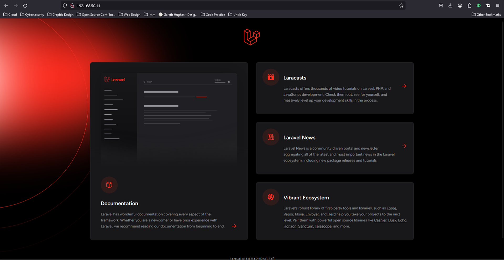

## Cloud Engineering Second Semester Examination Project

### Automate the provisioning of two Ubuntu-based servers, named “Master” and “Slave”, using Vagrant.

- On my windows machine, I created a folder named second_semester using `mkdir second_semester` 
- I initiated vagrant in the folder creating a Vagrantfile using `cd second_semester` >> `vagrant init ubuntu/focal64`
- I edited the vagrant file using VSCode - `code Vagrantfile`
- I added the following lines of code to configure my master and slave nodes:
```  config.vm.define "master" do |subconfig|
    subconfig.vm.box = "ubuntu/focal64"
    subconfig.vm.hostname = "master"
    subconfig.vm.network "private_network", ip: "192.168.50.10"
  end

  config.vm.define "slave" do |subconfig|
    subconfig.vm.box = "ubuntu/focal64"
    subconfig.vm.hostname = "slave"
    subconfig.vm.network "private_network", ip: "192.168.50.11"
  end
```
- I did `vagrant up` to spin up the machines
- I did `vagrant ssh master` and in a different bash window `vagrant ssh slave`


- In the master machine, I set my password for the user root using `passwd root`


- I generated Keygen using `ssh-keygen` and copied the key


- I moved to the slave bash window and did changed to root
- I did `vi ~/.ssh/authorized_keys` and pasted the keys
- I tested the ssh key on master by running `ssh root@192.168.50.11` and prompting yes when I was prompted


- I exited from the ssh connection
- I created a directory- lamp_deploy `mkdir lamp_deploy`

### On the Master node, create a bash script to automate the deployment of a LAMP (Linux, Apache, MySQL, PHP) stack. This script should clone a PHP application from GitHub, install all necessary packages, and configure Apache web server and MySQL.

- I installed ansible `apt update` `apt install ansible`


- I created deploy.yml (The ansible file), deploy.sh (The Bash Script) and host (my inventory). See [deploy.sh here](/lamp_deploy/deploy.sh), [and deploy.yml here](/lamp_deploy/deploy.yml).


- I ran the playbook using `ansible-playbook -i host deploy.yml`


- I added a monitor.log file in the bash script to be able to monitor the progress of the playbook in the slave machine at /root/monitor.log but doing `cat /root/monitor.log`
- I finally checked my browser with the ip address of the slave machine that I got using `hostname -I`

